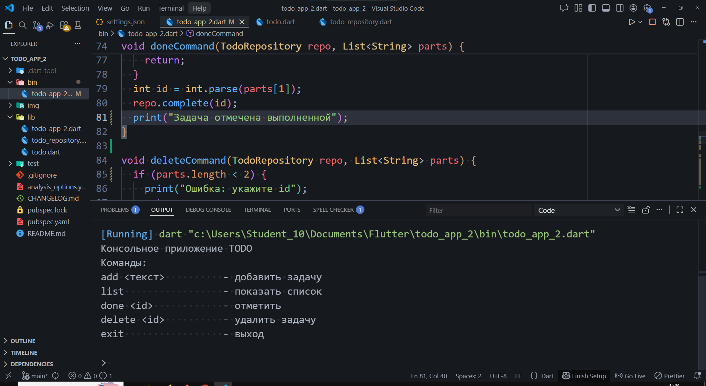

# Todo Console App

Консольное приложение для управления списком задач (Todo) на языке Dart.  
Проект создан в рамках лабораторной работы №1 по дисциплине "Flutter".

## Информация об авторе

Плеско Данил, Текутова Вика
ИСП-231

## Скриншот работающего приложения



## Как запустить проект

1. Клонировать репозиторий:
   ```bash
   git clone <URL вашего репозитория>
   cd todo_app
    ```

2. Убедиться, что установлен Dart SDK (версия 3.0+):

    ```bash
    dart --version
    ```

3. Установить зависимости (если не установлены):

    ```bash
    dart pub get
    ```
4. Запустить приложение:

    ```bash
    dart run bin/todo_app_2.dart
    ```

## Что изучено в ходе работы
- Основы синтаксиса Dart: переменные, типы данных, функции, классы.

- Null Safety и его отличия от Kotlin/C#.

- Именованные параметры и конструкторы.

- Работа с коллекциями: List, итерация, поиск по id.

- Асинхронное программирование: Future, async/await.

- Подключение и использование сторонних пакетов из pub.dev (ansicolor).

- Работа с Git и GitHub: коммиты, пуши, оформление репозитория

## Ответы на вопросы
1. Чем final отличается от const в Dart?
- final — переменная инициализируется один раз, значение может быть определено во время выполнения программы.

- const — переменная известна на этапе компиляции, значение полностью неизменяемо и вычисляется в compile-time.

2. Что означает String??
`String?` — nullable тип, который может содержать либо строку (`String`), либо `null`. Используется для обозначения переменных, которым допустимо не иметь значения.

3. Чем Future отличается от обычного значения? Что означает await с точки зрения потока выполнения?
- `Future<T>` представляет собой результат асинхронной операции, который станет доступен в будущем, в отличие от обычного значения, которое доступно сразу.

- `await` приостанавливает выполнение текущей асинхронной функции (не потока) до завершения `Future`, позволяя event loop'у обрабатывать другие события. Поток не блокируется.

4. Зачем в Dart именованные конструкторы, если в C# есть перегрузка?
В Dart не поддерживается перегрузка конструкторов (несколько конструкторов с разными параметрами, но одним именем). Вместо этого используются именованные конструкторы (например, `Todo.empty()`, `Todo.fromJson`()), которые позволяют создавать объекты разными способами, делая код более читаемым и явным.